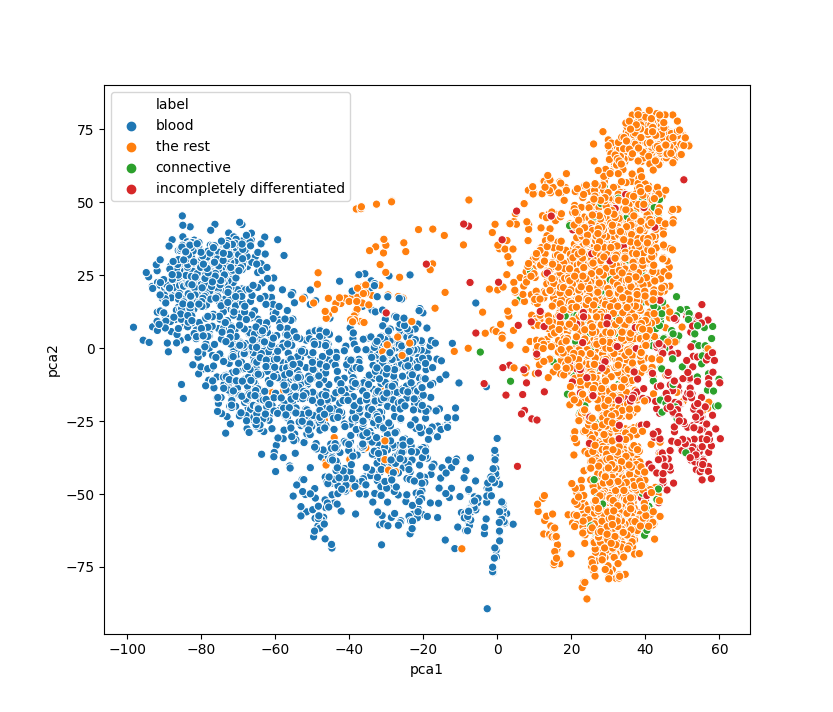

# GeneDataAnalysis

Analysis of Micro Array Gene data to detect different types of cancers. Studying the effects of Principle components on classification of different types of cancers. 

Lukk's Data PC1 and PC2

Lenz's Data PC1 PC2

Lenz's Data PC3 PC4

T-SNE plot of Lenz's Data with 75 perpelexity 

Classifier Performance chart with increasing Principal Components

 

